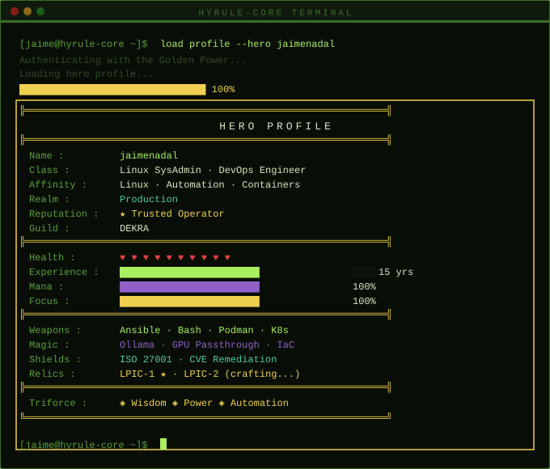

<!--
README de perfil GitHub
Crea un repositorio con el mismo nombre que tu usuario:
ej. jaimenadal / jaimenadal
y pega este contenido en README.md
-->

<h1 align="center">Hi there, I'm Jaime 👋</h1>
<h3 align="center">Linux SysAdmin · DevOps / Platform Engineer · Automation & Containers</h3>

<p align="center">
  
</p>

---

## 🎮 Currently loading...


```text
      ██████╗ ██╗   ██╗ ██████╗
      ██╔══██╗╚██╗ ██╔╝██╔═══██╗
      ██████╔╝ ╚████╔╝ ██║   ██║
      ██╔══██╗  ╚██╔╝  ██║   ██║
      ██║  ██║   ██║   ╚██████╔╝
      ╚═╝  ╚═╝   ╚═╝    ╚═════╝

  "Discipline beats noise.
   Good systems beat heroics.
   Automation turns effort into scale."
```
---

## 🚀 About me

I'm a Linux SysAdmin / DevOps-oriented engineer focused on enterprise infrastructure, automation and container platforms.

My background combines Linux administration, middleware, CI/CD, Kubernetes operations, virtualisation, web platforms, databases and cloud services. I'm especially interested in building reliable, standardised and observable environments across development and operations.

I also work with GPU-enabled Linux workloads, including NVIDIA drivers on RHEL, Podman GPU passthrough, Ollama and Open WebUI.

- 🐧 Linux-first engineer with strong focus on RHEL ecosystems, automation, containers and platform operations
- ⚙️ Experienced in application deployment, operations, troubleshooting and infrastructure standardisation
- 📦 Working with Kubernetes, Docker, Podman, VMware, KVM/QEMU and Proxmox
- 🤖 Interested in AI/GPU workloads on Linux — NVIDIA on RHEL, Podman GPU passthrough, Ollama and Open WebUI
- ☁️ Working across Azure and AWS
- 🧩 Comfortable bridging systems, middleware, databases, CI/CD and application operations
- 🌍 Languages: Spanish (native) · English (professional)

---

## 🌐 Let's connect

<p align="left">
  <a href="https://www.linkedin.com/in/jaime-nadal-lopez/" target="_blank">
    
  </a>
  <a href="mailto:jaimenadallopez@gmail.com">
    
  </a>
  <a href="https://github.com/jaimenadal">
    
  </a>
</p>

---

## 🧰 Tech stack

**Operating Systems**

<p>
  
  
  
  
  
  
  
  
</p>

**Containers & Platform**

<p>
  
  
  
  
  
</p>

**Virtualisation**

<p>
  
  
  
  
</p>

**Automation**

<p>
  
  
  
  
</p>

**Programming / Scripting**

<p>
  
  
  
</p>

**CI/CD & Versioning**

<p>
  
  
  
</p>

**Cloud**

<p>
  
  
</p>

**Web Servers**

<p>
  
  
  
</p>

**Databases**

<p>
  
  
  
  
</p>

**Middleware & Messaging**

<p>
  
</p>

**AI / GPU Workloads**

<p>
  
  
  
  
</p>

**Tools & Methodology**

<p>
  
  
  
  
  
  
</p>

---

## 🐍 Hyrule Terminal

<p align="center">
  
</p>

## 📌 What I usually work on

- Linux system administration and troubleshooting
- Platform operations for containerised applications
- Kubernetes application deployment & operations
- Automation with Ansible, Bash and shell scripting
- Middleware, web servers and database support
- CI/CD pipelines and delivery processes
- Hybrid cloud and infrastructure operations
- GPU-enabled AI workloads on enterprise Linux

---

## 📊 GitHub stats

<p align="center">
  
  
</p>
<p align="center">
  
</p>

---


---
